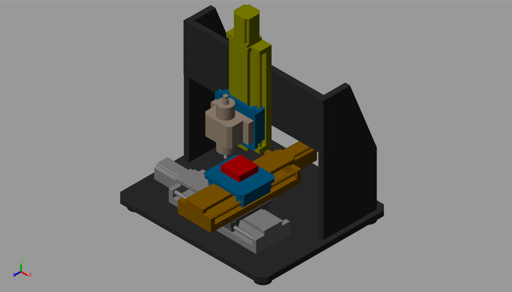

# Controller_Design
NUMERICAL VALIDATION OF A ROBUST POSITIONING CONTROLLER IN MACHINE TOOLS APPLICATION
---

## Running Tests

The Main file is in `Matlab` Folder. Access the folder and follow the steps as follows;

- Open the Live script the live script `Matlab_Script`
- Run the First section of the live script.
- Open the `Googol_XY_machine_test.slx` file, Run the simulation with respect to `PID`, `Cascade` and `SMC`. The output of the scope will be exported to the Matlab Workspace.
- Run the second section of `Matlab_Script` to plot the scopes output  from the 'out' Variable

